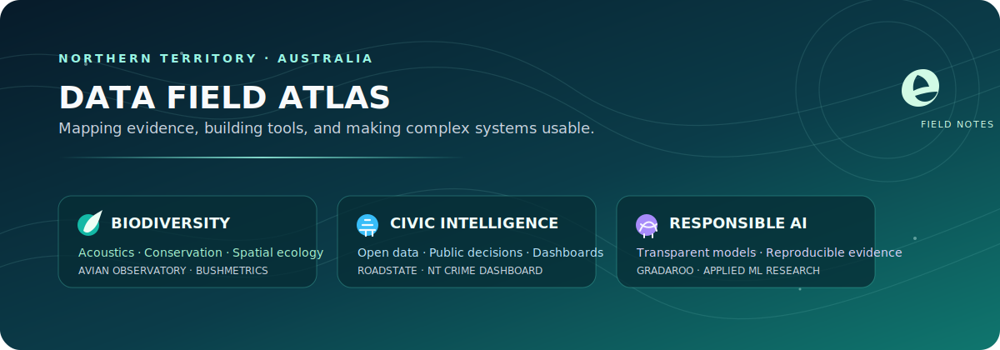

<p align="center">
  <strong>Master of Data Science student at Charles Darwin University</strong><br />
  Building practical, transparent data products for biodiversity, civic technology, and public decision-making in the Northern Territory.
</p>

<p align="center">
  <a href="https://harshrastogii.vercel.app/"></a>
  <a href="https://www.linkedin.com/in/harshrastogii/"></a>
  <a href="mailto:harshrastogi636@gmail.com"></a>
  
</p>

## About me

I turn complex data into clear, useful tools. Across my projects, I combine **spatial analytics, machine learning, data visualisation, civic technology, AI, and biodiversity science**—with an emphasis on reproducibility, transparency, and decisions that matter in the real world.

```text
Degree       Master of Data Science · Charles Darwin University
Based in     Darwin, Northern Territory, Australia
Community    Northern Territory Lead · GovHack
Building     Data products that make public and environmental data easier to use
```

<p align="center">
  
</p>

## Featured work

<table>
  <tr>
    <td width="50%" valign="top">
      <h3>🌿 <a href="https://github.com/harshrastogii/biodiversity-surrogate-validation">Biodiversity Surrogate Validation</a></h3>
      <p>Pre-registered research testing whether open spatial data can reliably reproduce independent expert biodiversity assessments in the Northern Territory.</p>
      <sub>Python · GeoPandas · spatial statistics · reproducible research</sub>
    </td>
    <td width="50%" valign="top">
      <h3>🗺️ <a href="https://github.com/harshrastogii/bushmetrics">BushMetrics</a></h3>
      <p>Interactive analysis of whether NT protected areas represent its land and bioregions fairly.</p>
      <sub>React · Leaflet · FastAPI · GeoPandas · <a href="https://bushmetrics.vercel.app/">live app</a></sub>
    </td>
  </tr>
  <tr>
    <td width="50%" valign="top">
      <h3>🐦 <a href="https://github.com/harshrastogii/AvianObservatory">Avian Observatory</a></h3>
      <p>An environmental-intelligence platform that identifies NT birds from audio, then connects detections with spatial and biodiversity context for conservation decisions.</p>
      <sub>Python · FastAPI · Next.js · PostgreSQL · TensorFlow · BirdNET</sub>
    </td>
    <td width="50%" valign="top">
      <h3>🚦 <a href="https://github.com/harshrastogii/RoadState">RoadState</a></h3>
      <p>An interactive NT report on traffic, commuting, and wet-season road access using open government data.</p>
      <sub>Next.js · TypeScript · Visx · <a href="https://roadstate.harshrastogii.com">live app</a></sub>
    </td>
  </tr>
  <tr>
    <td width="50%" valign="top">
      <h3>🎓 <a href="https://github.com/harshrastogii/Gradaroo">Gradaroo</a></h3>
      <p>A graduate-job discovery platform that starts from the employers known to hire a university's graduates.</p>
      <sub>Python · Streamlit · Adzuna API · Gemini · <a href="https://gradaroo.com">live app</a></sub>
    </td>
    <td width="50%" valign="top">
      <h3>📊 <a href="https://github.com/harshrastogii/nt-crime-dashboard">NT Crime Dashboard</a></h3>
      <p>Interactive recorded-crime analysis with regional and per-capita views that reveal patterns raw counts can hide.</p>
      <sub>Python · Plotly Dash · pandas</sub>
    </td>
  </tr>
</table>

<details>
  <summary><strong>Explore more projects</strong></summary>
  <br />

  | Project | Focus |
  |---|---|
  | [NT Conservation Exposure](https://github.com/harshrastogii/nt-conservation-exposure) | A transparent conservation-exposure index, independently validated against expert biodiversity assessment. |
  | [ArmaWatch](https://github.com/harshrastogii/ArmaWatch) | An accessible modern map of Australian weapons-industry facilities, prepared for Wage Peace. |
  | [Australian Charities Analytics](https://github.com/harshrastogii/PRT564-Group2-CharityAnalysis) | ACNC Charity Register analysis for public-sector and philanthropic decision-making. |
</details>

## Experience in analytics

| Role | Analytics focus |
|---|---|
| **Senior Treasury & Reconciliation Specialist** | Process improvement and analytics—using data to strengthen workflows, controls, and operational decisions. |
| **Treasury Analyst** | Treasury analytics and reporting, including SQL-driven reporting for stakeholder decision-making. |
| **Reconciliation Analyst** | Data quality and analytics across reconciliation processes, supporting accurate, controlled financial operations. |

## Toolkit

<p>
  
  
  
  
  
  
  
  
  
  
</p>

## GitHub activity

<p align="center">
  
</p>

<p align="center">
  <sub>Metrics are refreshed weekly by GitHub Actions.</sub>
</p>

<p align="center">
  <i>Interested in applied data science, biodiversity monitoring, responsible AI, and civic technology?</i><br />
  <a href="https://harshrastogii.vercel.app/">Portfolio</a> · <a href="https://www.linkedin.com/in/harshrastogii/">LinkedIn</a> · <a href="mailto:harshrastogi636@gmail.com">Email</a>
</p>
