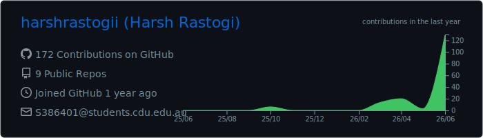

<h1 align="center">Hi, I'm Harsh Rastogi 👋</h1>

<p align="center">
  <strong>Data scientist building practical tools for biodiversity, civic data, and public-interest technology.</strong><br />
  Master of Data Science, Charles Darwin University · Darwin, Northern Territory, Australia
</p>

<p align="center">
  <a href="https://harshrastogii.vercel.app/"></a>
  <a href="https://www.linkedin.com/in/harshrastogii/"></a>
  <a href="mailto:harshrastogi636@gmail.com"></a>
</p>

## About

I turn complex data into transparent, useful products. My work combines spatial analysis, machine learning, interactive dashboards, and careful data governance—especially for Northern Territory environmental and civic-data questions.

Previously, I worked in corporate treasury and reconciliation, leading a 20-person team and building SQL-driven reporting and controls. I now bring that same accuracy-first mindset to applied data science.

```text
Now        Master's research in biodiversity data science and AI
Focus      Spatial analytics · ML · data visualisation · civic technology
Community  President, CDU ITSA · Northern Territory Lead, GovHack 2025
```

## Selected projects

| Project | What it does | Built with |
|---|---|---|
| [Biodiversity surrogate validation](https://github.com/harshrastogii/biodiversity-surrogate-validation) | Pre-registered research testing how well open spatial data can reproduce independent expert biodiversity assessments in the NT. | Python · GeoPandas · spatial statistics |
| [NT Conservation Exposure](https://github.com/harshrastogii/nt-conservation-exposure) | A transparent Territory-wide conservation exposure index, independently validated against expert biodiversity assessment. | Python · geospatial analysis · reproducible research |
| [BushMetrics](https://github.com/harshrastogii/bushmetrics) · [Live app](https://bushmetrics.vercel.app/) | Interactive analysis of how representatively NT protected areas cover different landscapes and bioregions. | React · Leaflet · FastAPI · GeoPandas |
| [NT Bird Acoustic Monitor](https://github.com/harshrastogii/BirdDashboard) | AI-powered NT bird identification and acoustic-monitoring dashboard for field ecology. | Python · TensorFlow · BirdNET · Streamlit |
| [RoadState](https://github.com/harshrastogii/RoadState) · [Live app](https://roadstate.harshrastogii.com) | Interactive report on NT traffic, commuting, and wet-season road access using government open data. | Next.js · TypeScript · Visx |
| [NT Crime Dashboard](https://github.com/harshrastogii/nt-crime-dashboard) | Interactive recorded-crime analytics, including regional and per-capita views. | Python · Plotly Dash · pandas |
| [Gradaroo](https://github.com/harshrastogii/Gradaroo) · [Live app](https://gradaroo.com) | Graduate-job discovery platform that begins with employers known to hire a university's graduates. | Python · Streamlit · Adzuna API · Gemini |
| [ArmaWatch](https://github.com/harshrastogii/ArmaWatch) | Modern, accessible map of Australian weapons-industry facilities, prepared for Wage Peace. | React · TypeScript · MapLibre |
| [Australian Charities Analytics](https://github.com/harshrastogii/PRT564-Group2-CharityAnalysis) | Group analysis of the ACNC Charity Register for public-sector and philanthropic decision-making. | Python · SQL · Power BI · scikit-learn |

## Toolkit

`Python` · `SQL` · `R` · `pandas` · `scikit-learn` · `TensorFlow` · `GeoPandas` · `Plotly` · `Power BI` · `React` · `Next.js` · `FastAPI` · `Streamlit` · `Docker`

## GitHub activity

<p align="center">
  
</p>

## Let's connect

I'm always interested in applied data science, biodiversity monitoring, responsible AI, and civic technology.

[Portfolio](https://harshrastogii.vercel.app/) · [LinkedIn](https://www.linkedin.com/in/harshrastogii/) · [Email](mailto:harshrastogi636@gmail.com)
