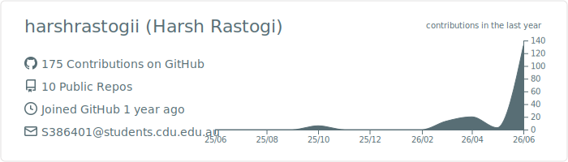

<h1 align="center">👋 Hi, I'm Harsh Rastogi</h1>
<h3 align="center">Master of Data Science @ Charles Darwin University | Darwin, NT 🇦🇺</h3>

<strong>Turning messy, real-world data into actionable decisions</strong> — across biodiversity monitoring, civic tech, public services, and the not-for-profit sector.

👨‍💻 About Me

I’m a data science postgrad with a 2-year background in corporate treasury & financial reconciliation at WNS Global Services, where I led a 20-person team delivering SQL-driven reporting, regulatory controls, and compliance.

This foundation shapes my data work today: accuracy-first, governance-aware, and hyper-focused on decisions that matter for real communities. At CDU, I build deployable data solutions across civic tech, biodiversity, and student services, while leading industry and student leadership initiatives.
📌 Current Snapshot (At a Glance)

# Auto-updated core priorities
now:         Master of Data Science @ CDU (Grad Nov 2026)
building:    NT Crime Dashboard · NT Roads Insights · NT Protected Areas · WhereGradsGo · NT Birds Classifier · RAG for Student Central · ACNC Charity Analytics
prior:       Senior Treasury & Reconciliation Specialist (18mo Top Performer)
leading:     CDU ITSA President · GovHack NT Lead · CDU Academic Board Sub-Committee
location:    Darwin, Northern Territory 🇦🇺
🚀 Featured Projects

Every project prioritizes data honesty, real-world utility, and deployable solutions for Northern Territory communities.
🗺️ NT Crime Intelligence Dashboard

Self-directed · Deployed · Interactive analytics on NT recorded-offence data

An interactive dashboard analysing Northern Territory recorded-offence data, with cross-filtering across time, region, offence type, and alcohol/domestic-violence flags. Built end-to-end (data cleaning → per-capita normalisation → interactive map) and deployed live.

🔍 Key Insight: The per-capita view flips the headline story. Raw counts show Darwin dominates, but normalised against population, remote regions like Tennant Creek have a ~7× higher offence rate. The build intentionally flags (rather than smooths over) a 2025 ANZSOC classification change and excludes the "NT Balance" catch-all from maps to avoid misrepresentation.

🚦 NT Roads Insights

Deployed · Multi-tab road safety & traffic dashboard from NT open data

A Streamlit dashboard unifying scattered NT Government road datasets (traffic volumes, commute corridors, road-safety trends, wet-season closures) into a single interactive tool for both daily commuters and local policymakers.

🔍 Key Insight: Stitches together disconnected PDFs, spreadsheets, and open datasets that were previously inaccessible to non-technical users, adding seasonality analysis and multi-year trend mapping.

🗺️ NT Protected-Area Coverage

Full-stack spatial analysis · Deployed · Is the NT's reserve network representative?

A full-stack web app analysing whether the Northern Territory's protected areas safeguard a representative cross-section of its land. A React + Leaflet frontend talks to a FastAPI backend that runs spatial analysis on demand, returning per-bioregion coverage and gap statistics to an interactive map.

🔍 Key Insight: The reserve network over-represents rugged northern country and under-protects the arid interior. The Tanami — the Territory's largest bioregion at ~538,000 km² — is a statistically significant cold spot at just 0.6% protection, a gap that raw area totals completely hide.

🎓 WhereGradsGo — AI Graduate Job Finder

Deployed · Helping students start their job search from the right employers

An AI-assisted job-search app for Australian graduates. Pick from 40 universities (ranked by QS), see key graduate employers for that institution, and browse live openings pulled from the Adzuna job API. Upload a resume and Gemini matches roles to your actual skills; one click takes you to the original posting.

🔍 Key Insight: Data honesty is a first-class design principle. Curated, regionally-sourced employer lists are clearly distinguished from state-level approximations, nothing is scraped, and resume-privacy is spelled out up front — the app never pretends its data is something it isn’t.

🐦 Northern Territory Birds — Acoustic Species Classification

Master's research project · AI for biodiversity monitoring in the NT

Building a deep-learning pipeline that identifies NT bird species from field audio, paired with an interactive dashboard so ecologists and environmental researchers can upload recordings, get automated species detection, and explore biodiversity insights without technical knowledge.

🔍 Key Insight: Most ecoacoustic models are trained on Northern-Hemisphere species datasets. This project tackles the gap for NT avian fauna, with a literature review across 5–10 Q1/top-conference papers to justify model selection and identify limitations of existing approaches.

🤖 CDU Student Central — RAG-Based AI Assistant

Early-stage build · Replacing front-desk queries with a source-cited AI chatbot

A Retrieval-Augmented Generation assistant that answers common CDU Student Central questions (enrolment, fees, policy, IT services) — grounded in official CDU content with source citations. When the AI can’t confidently answer, it drafts a pre-filled escalation email to the right CDU team with one-click send.

🔍 Key Insight: Designed as a full-stack RAG system that crawls cdu.edu.au and subdomains, chunks/embeds content, and re-ingests on policy changes — so the knowledge base stays current without retraining the underlying model.

📊 Australian Charities Analytics — PRT564 Group Project

Data Analytics & Visualisation coursework · ACNC Charity Register

A team analytics project on the Australian Charities & Not-for-profits Commission (ACNC) Charity Register, producing descriptive, predictive, and diagnostic insights relevant to public-sector and philanthropic decision-making. Covers research question design, methodology justification, and end-to-end analytical pipeline from raw data to dashboard.

💼 Professional Experience

Structured for scannability — no content changes
Customer Service Coordinator & Residential Advisor

UniLodge Australia · Feb – Nov 2025 (Previous Role)

Front-desk operations, lease & payment administration
After-hours emergency response & residential-life programming
🏅 Awarded UniLodge "On the Spot Award" (Nov 2025) for leadership during Severe Tropical Cyclone Fina
Freelance Data Analytics Instructor

CDU ITSA · May – Jul 2025

Delivered 4-part "Data Bytes" workshop series (A$800 contract) teaching Excel, Power Query, PowerApps, and Power BI using real NT Government open datasets
📣 Recognised by CDU Vice-Chancellor Professor Scott Bowman AO in all-staff communications for workshop delivery
Senior Treasury & Reconciliation Specialist

WNS Global Services · Apr – Nov 2024

Led 20-person treasury & reconciliation team under SLA & regulatory constraints
18 consecutive months as Top Performer
Resolved complex suspense-account discrepancies preventing significant financial exposure
Treasury Analyst

WNS Global Services · Aug 2023 – Apr 2024

Delivered SQL & Power BI reporting for senior stakeholders
Designed QC procedures that reduced processing errors & strengthened financial governance
Reconciliation Analyst

WNS Global Services · Sep 2022 – Sep 2023

Reconciliation analysis across multiple client accounts
Supported R2R transition for new client onboarding
🏛️ Leadership & Community

Driving student engagement, civic tech, and industry collaboration in the Northern Territory

Role	Organisation	Period	Status
President	CDU Information Technology Student Association (ITSA)	Mar 2025 – Present	🟢 Active
Northern Territory Lead	GovHack 2025	Jul 2025 – Present	🟢 Active
Student Representative	CDU Learning & Teaching Committee (Academic Board Sub-Committee)	Feb 2026 – Present	🟢 Upcoming
Student Representative	Your Voice Student Network, CDU	Feb 2025 – Present	🟢 Active
🛠️ Tech Stack

Organized into clean, scannable categories

<table align="center" style="width:100%">
<tr>
<th>📊 Data Science & Languages</th>
<th>🤖 ML & AI</th>
<th>📈 BI & Visualization</th>
<th>🌐 Web & Infra</th>
</tr>
<tr>
<td align="center">

</td>
<td align="center">

</td>
<td align="center">

</td>
<td align="center">

</td>
</tr>
</table>

📊 GitHub Stats

Dynamic, auto-updated summary of open-source contributions

🤝 Let's Connect

Always open to collaboration and conversation

[!TIP]

I’m particularly keen to chat about:

RAG systems & source-cited AI for public services
Ecoacoustic ML for Australian biodiversity monitoring
Using open government data for Northern Territory community impact
Breaking into the Australian data science sector

<em>⚡ "Data is most useful when it's made usable for the people it's meant to serve."</em>

