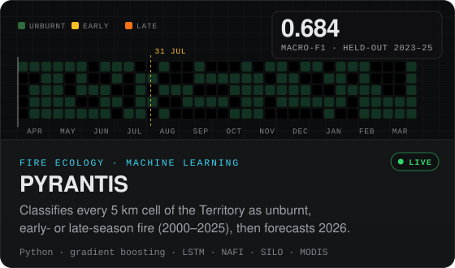
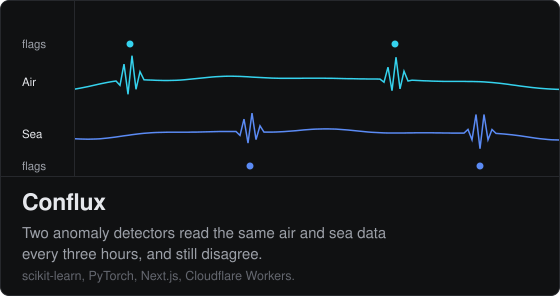
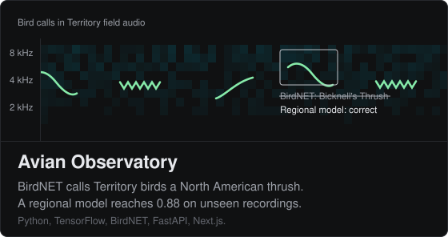
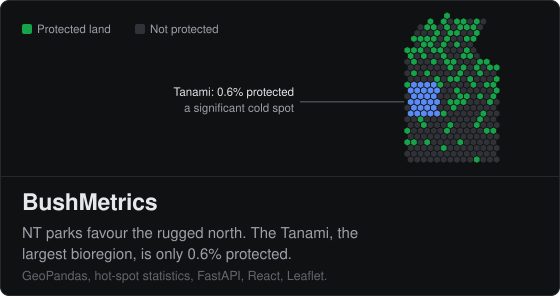
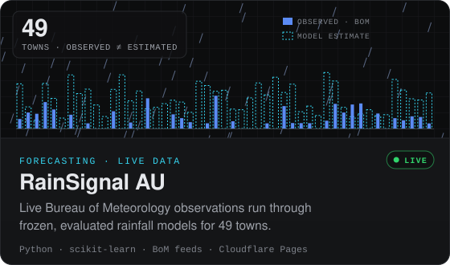
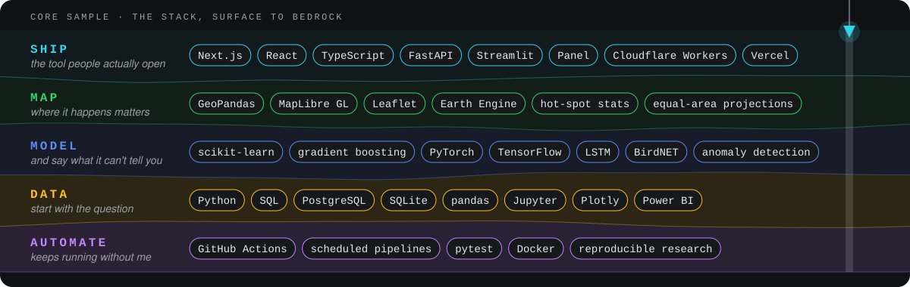

<a href="https://harshrastogi.au/">
  
</a>

  
  
  
  

  <b>Master of Data Science at Charles Darwin University · Treasury analyst turned data scientist · GovHack NT Lead</b> 
  Environmental intelligence, spatial analysis and full-stack delivery: taking open Territory data from a raw feed 
  to something a council, a researcher or a traveller can actually act on.

## Field instruments

Each card is a small working model of the project behind it. Click through to the live tool.

  <a href="https://underlink-nt.vercel.app/"></a>
  <a href="https://pyrantis.harshlabs.workers.dev/"></a>

  <a href="https://conflux.harshlabs.workers.dev/"></a>
  <a href="https://terraiq-nt.vercel.app/"></a>

  <a href="https://avianobservatory.vercel.app/"></a>
  <a href="https://bushmetrics.vercel.app/"></a>

  <a href="https://github.com/harshrastogii/rainsignal-au"></a>
  <a href="https://roadstate.harshrastogii.com"></a>

  
<b>The full field log: every project, what it found, and where to open it</b>

   

| Project | What it found | Open |
|---|---|---|
| **Underlink** | A coverage map shows a signal, not what it depends on. 18 of 23 remote places that reach fibre by radio rely on a relay with no other licensed path. CDU Code Fair 2026. | [live](https://underlink-nt.vercel.app/) · [code](https://github.com/harshrastogii/underlink-nt) |
| **PYRANTIS** | Wet-season air dryness, greenness and rain, not fire history, are the strongest predictors of when the savanna burns. 0.684 macro-F1, and it beats "same as last year" in all 66 walk-forward tests. | [live](https://pyrantis.harshlabs.workers.dev/) · [code](https://github.com/harshrastogii/PYRANTIS) · [talk](https://youtu.be/c_0yCsdZX2U) |
| **RainSignal AU** | Live BoM observations against frozen, evaluated models for 49 towns. Observations and estimates are never conflated, and stale data is shown as stale. | [code](https://github.com/harshrastogii/rainsignal-au) |
| **Conflux** | Air and sea, compared directly every three hours. Two detectors that shared their inputs still disagreed. | [live](https://conflux.harshlabs.workers.dev/) |
| **TerraIQ** | A Territory-wide weather memory from 44 BOM stations, holding what the public feed drops after 72 hours. | [live](https://terraiq-nt.vercel.app/) |
| **Avian Observatory** | On Territory audio, BirdNET confidently answers Bicknell's Thrush, a bird of the north-eastern US. A regional model reaches 0.88 on recordings it never saw. | [live](https://avianobservatory.vercel.app/) |
| **BushMetrics** | The reserve network protects rugged northern country and skips the arid interior. The Tanami is a statistically significant cold spot at 0.6%. | [live](https://bushmetrics.vercel.app/) · [code](https://github.com/harshrastogii/bushmetrics) |
| **RoadState** | The Territory's road problem is seasonal access, not congestion: 78% of traffic is in Darwin and 66% of the year's closures begin in the wet. | [live](https://roadstate.harshrastogii.com) · [code](https://github.com/harshrastogii/RoadState) |
| **NT Crime Intelligence** | Switching from raw counts to per-capita rates reorders which communities are most affected. Ships a clean 2008–2026 public dataset. | [live](https://harshrastogii-nt-crime-dashboard.hf.space/) · [code](https://github.com/harshrastogii/nt-crime-dashboard) |
| **ArmaWatch** | A mobile-friendly rebuild of Wage Peace's map of 127 Australian weapons-industry sites, with filters, summaries and CSV export. | [live](https://armawatch.vercel.app/) · [code](https://github.com/harshrastogii/ArmaWatch) |
| **Gradaroo** | An AI-assisted graduate job finder covering 40 universities, live listings and resume matching. Nothing is scraped. | [live](https://gradaroo.com) |
| **Biodiversity Surrogate Validation** | A pre-registered test of open spatial surrogates against expert assessment. Vegetation-type rarity won, but only modestly: these are screens, not substitutes. | [code](https://github.com/harshrastogii/biodiversity-surrogate-validation) |
| **NT Conservation Exposure** | A transparent conservation-exposure index, independently validated against expert biodiversity assessment. | [code](https://github.com/harshrastogii/nt-conservation-exposure) |
| **Australian Charities Analytics** | Descriptive, predictive and diagnostic analysis of the ACNC Charity Register. | [code](https://github.com/harshrastogii/PRT564-Group2-CharityAnalysis) |
| **Student Central RAG** | *In progress.* Answers student questions from official CDU content with citations, and drafts an escalation email when it can't answer confidently. | coming soon |
| **harshrastogi.au** | The portfolio and writing: a static site with no framework, built and deployed from Darwin. | [live](https://harshrastogi.au/) · [code](https://github.com/harshrastogii/portfolio) |

## How I work

> **01 · I start with the question, not the dataset.** Before I write a query I want to know what decision is waiting on the answer. 
> **02 · I ship the tool, not the notebook.** Every project above ends as something deployed and reachable. 
> **03 · I say what the data doesn't support.** The surrogates were only modestly useful. Conflux's two detectors didn't agree. Both findings are published. 
> **04 · I build it so it keeps running without me.** Scheduled jobs, no servers to babysit, and a plain-English reading on every chart.

## Toolkit

  

## Field signal

  

Redrawn every day from the GitHub contribution calendar by <a href="./.github/workflows/field-signal.yml">a scheduled workflow</a>. No third-party stats service.

## Before data science

| Role | What I brought from it |
|---|---|
| **Senior Treasury & Reconciliation Specialist** | Process improvement and analytics: using data to strengthen workflows, controls and operational decisions. |
| **Treasury Analyst** | SQL-driven treasury reporting for stakeholder decisions, and an instinct for what a number is actually going to be used for. |
| **Reconciliation Analyst** | Data quality across reconciliation processes, keeping financial operations accurate and controlled. |

  <a href="https://harshrastogi.au/">harshrastogi.au</a> ·
  <a href="https://www.linkedin.com/in/harshrastogii/">LinkedIn</a> ·
  <a href="mailto:harshrastogi636@gmail.com">harshrastogi636@gmail.com</a> 
  Every animation on this page is hand-built SVG, generated by the scripts in <a href="./scripts">/scripts</a>.  
  

